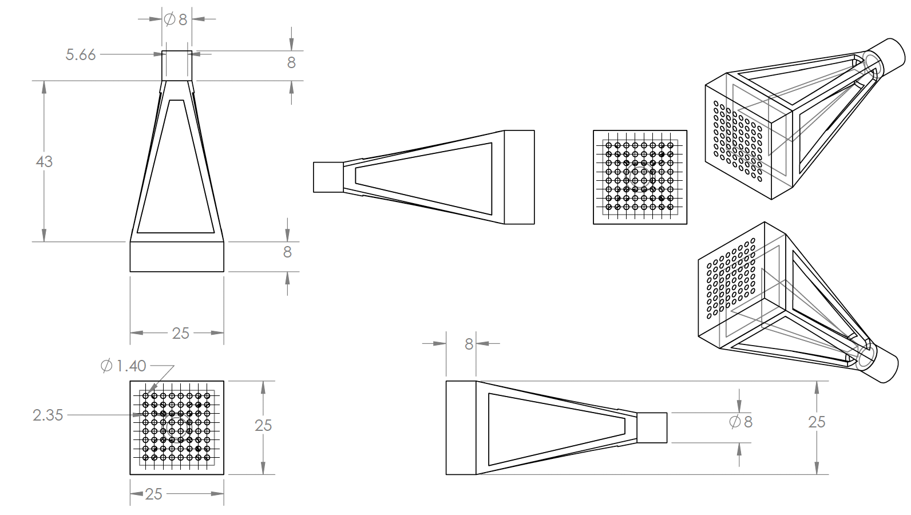
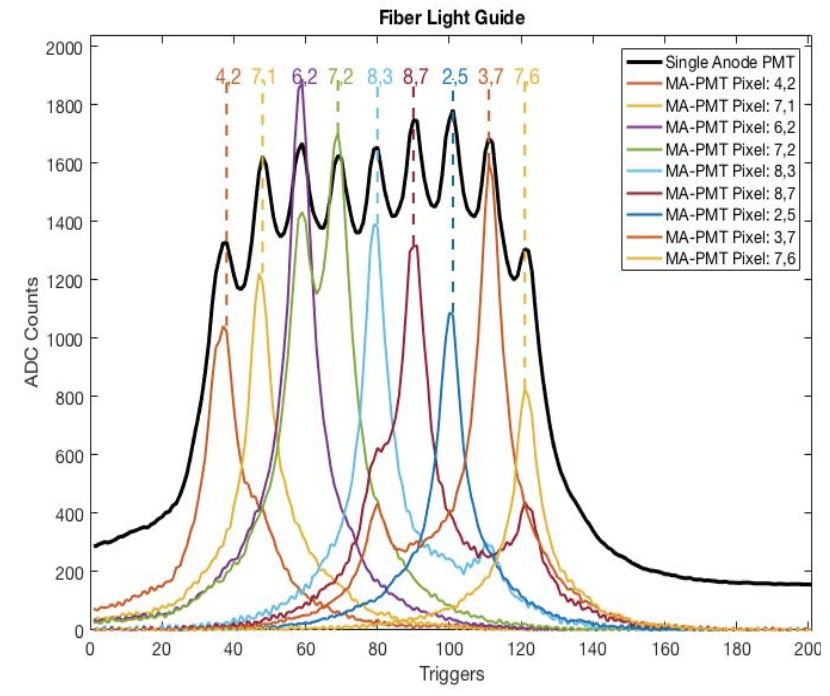

# CERN Tile Calorimeter Multi-Anode Photomutiplier Tubes(MA-PMT) Analysis
    
The code in this repository is designated for the analysis code I developed for using MA-PMTs in the tile calorimeter. Currently the code is in MATLAB and performs analysis on different readout channels of a MA-PMT. The code run all in the source directory should perform the analysis on a data file in the data directory(all files are zipped). These files are originally root files written out from the tile calorimeter which are converted using a script I created to a txt file. These files are then read into Matlab and saved as mat files for later analysis. The source repo contains various analysis methods performed on the data. Additionally, the mechanical design for a fiber coupler is in this repository under mechanical design, which I designed in Solidworks. Finally, additional analysis for an optics test bench is in the top level for the use of a Focon for fiber coupling. As a result of this analysis a design was written and proposed to ATLAS for review in the next upgrade cycle. 